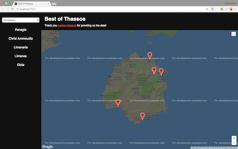
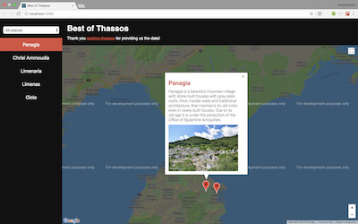
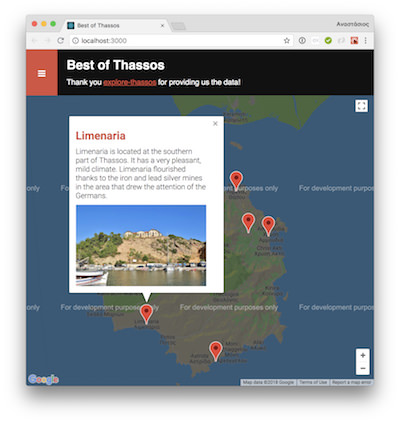

# Neighborhood Map

I created this website for the purposes of the [Udacity's Front-End Web Developer Nanodegree Program](https://www.udacity.com/course/front-end-web-developer-nanodegree--nd001) to showcase my skills in **React**.

## How to Load the Website

- Clone the **[repo](https://github.com/anastasioscho/udacity-neighborhood-map.git)**.
- Install [Node.js](https://nodejs.org/en/).
- In a terminal, cd into the project directory.
- Install all project dependencies with `npm install`.
- Start the development server with `npm start`.

## Screenshots

  

## Notes

### Create React App

This project was bootstrapped with [Create React App](https://github.com/facebookincubator/create-react-app).

### Supported Browsers

By default, the generated project uses the latest version of React.

You can refer [to the React documentation](https://reactjs.org/docs/react-dom.html#browser-support) for more information about supported browsers.

### Progressive Web App

By default, the production build is a fully functional, offline-first [Progressive Web App](https://developers.google.com/web/progressive-web-apps/).

## Attributions

A special thanks goes to [explore-thassos.com](https://explore-thassos.com) for providing all the location data i've used for this project.